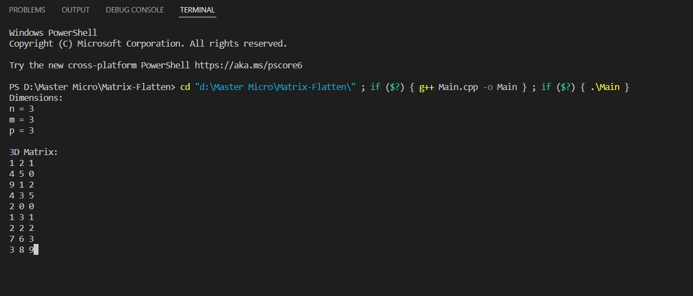
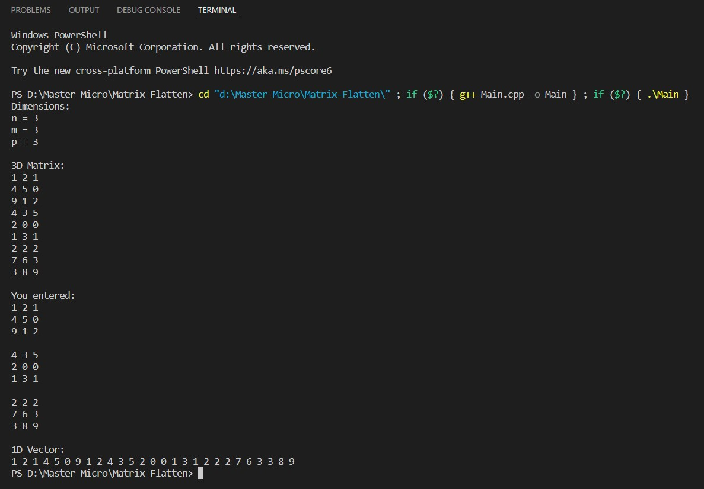
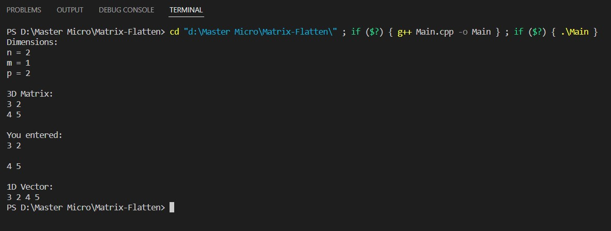
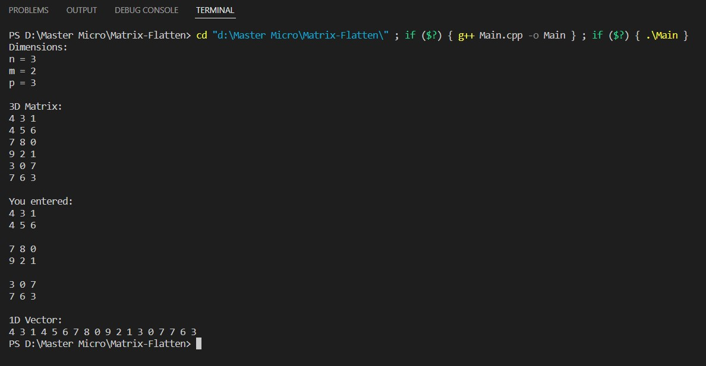
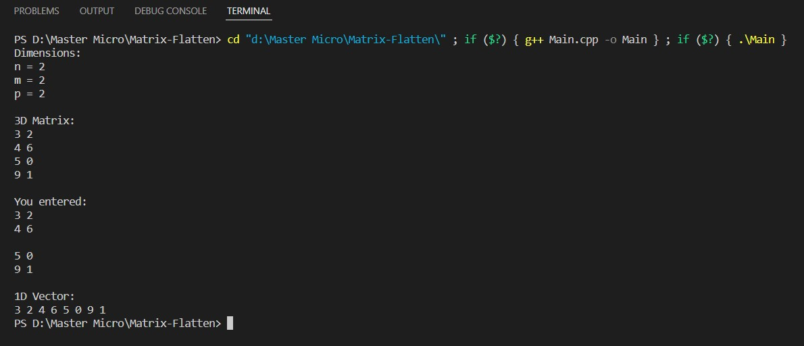

<div align="center">

# Matrix Flatten

</div>

## 📙 About
* A 3D matrix is to be stored in a 1D vector (flattened).
## 📝 Description
* Convert the 3D matrix index (i, j, k) to a suitable 1D vector index (y). Must be O(1).

## 🏁 Getting Started

### Dependencies

* C++

### 💻 Installing

```
git clone https://github.com/abdelrahman0123/Matrix-Flatten 
```

```
g++ Main.cpp
```

```
./a.out
```

### 📷 Screenshots

#### Fill 3D matrix with unique numbers


#### Convert 3D matrix into 1D vector using the formula y = i * m * p + j * p + k


#### Test random cases





## Contributors

<table>
<tr>
<td align="center">
<a href="https://github.com/abdelrahman0123" target="_blank">
<br /><sub><b>Abdelrahman Hamdy</b></sub></a><br />
</td>
</tr>
 </table>

## License

This project is licensed under the [MIT] License - see the [LICENSE.md](LICENSE) file for details
